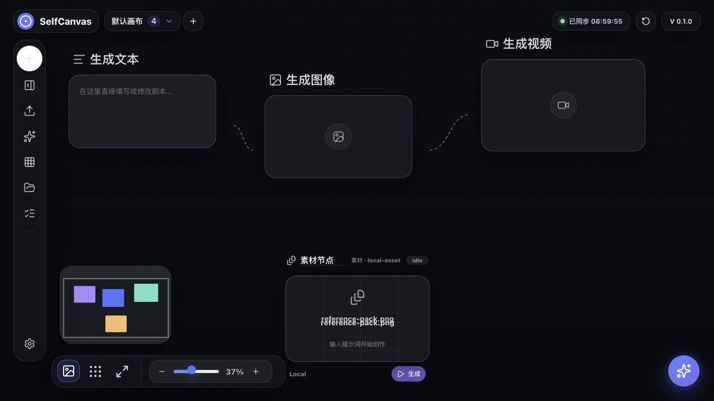
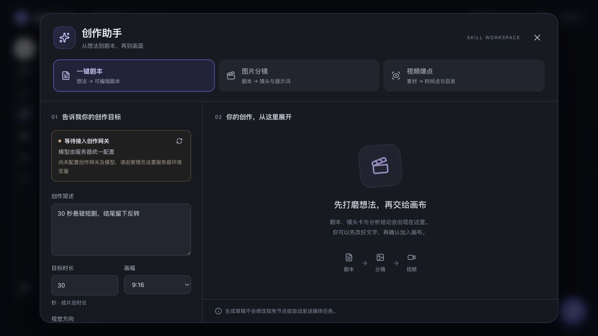

# SelfCanvas

面向 AI 短剧、分镜与多媒体创作的可自托管画布工作台。把文本、图片、视频、音频和参考素材连接到同一张画布，从创意草稿逐步推进到生成任务与文件交付。

基于 React、TypeScript、React Flow、Zustand、Vite、Python API 与 Redis / BullMQ；提供 Codex MCP 接口和 SwiftUI iPhone 内测客户端。

## 界面预览

### 画布工作区

多画布分页、节点连线、缩放与小地图，以及服务器同步状态。



### 创作助手

一键剧本、图片分镜、视频爆点分析集中在同一个工作区。草稿可先编辑，再确认加入画布；媒体生成需要单独提交。



截图摄于 2026-09-13，来自当前源码运行的独立本机预览环境。画布为默认示例，创作网关未配置，因此界面如实显示「等待接入创作网关」；截图不代表已完成真实模型生成。

## 主要功能

| 模块 | 功能 |
| --- | --- |
| 节点画布 | 文本、图片、视频、音频、分镜及素材节点；拖拽、连线、分组与工作流 |
| 创作助手 | 生成候选剧本、拆解镜头与提示词、分析视频时间点及创作手法 |
| 模型配置 | AnyCap 模型目录与参数校验；按节点选择已实现的提供方 |
| 媒体任务 | Redis / BullMQ 队列、任务状态、媒体预览与下载 |
| 视频处理 | 独立剪辑 worker、FFmpeg 合并与转场；部分 AI 编辑功能需要模型接入 |
| 项目与素材 | 浏览器本地保存、服务器版本校验及冲突提示、素材搜索与筛选 |
| Codex MCP | 读取和修改画布、查询任务与素材、按授权提交生成或创作草稿 |
| iPhone 客户端 | SwiftUI 内测版：登录、项目、创作、任务与资产页面 |

## 本机启动

准备 Node.js 22.12+、npm 和 Python 3.11+。运行媒体任务还需要 Redis；视频处理需要 FFmpeg / FFprobe，AnyCap 生成需要另外安装并登录 AnyCap CLI。

```bash
git clone https://github.com/xiaochendeep/selfcanvas.git
cd selfcanvas
npm ci
cp .env.example .env
```

按用途修改 `.env` 中的服务地址、模型和凭据；示例地址需要替换成自己的服务。

**只预览前端：**

```bash
npm run dev
```

打开 [http://127.0.0.1:5190/](http://127.0.0.1:5190/)。未启动 API 时会显示离线，本机画布仍可编辑，但服务器同步与生成不可用。

**启用本地 API：** 另开终端运行：

```bash
npm run server
```

健康检查：[http://127.0.0.1:8787/api/health](http://127.0.0.1:8787/api/health)。如需由 Python 直接提供完整页面，先执行 `npm run build`，再打开 [http://127.0.0.1:8787/](http://127.0.0.1:8787/)。

**运行媒体任务：** 完成提供方配置后，在独立终端分别启动：

```bash
redis-server
```

```bash
npm run worker
```

```bash
npm run worker:video-edit
```

worker 启动后会消费已有队列。接入模型前先核对待执行任务；模型调用可能产生费用。

## 模型与创作网关

| 用途 | 接入方式 |
| --- | --- |
| 文本 / 分镜节点 | Sub2API 或已实现的 OpenAI 兼容提供方 |
| 图片节点 | AnyCap、Sub2API 或已实现的 OpenAI 兼容提供方 |
| 视频 / 音频节点 | AnyCap CLI；参数依当前模型 schema 校验 |
| 创作助手剧本 / 分镜 | 服务端配置的 OpenAI 兼容文本网关 |
| 创作助手视频分析 | Gemini 原生视频理解协议，或明确支持视频输入的兼容网关 |

创作助手使用 `SELF_CANVAS_CREATIVE_BASE_URL`、`SELF_CANVAS_CREATIVE_API_KEY`、`SELF_CANVAS_CREATIVE_TEXT_MODEL` 等变量；视频理解可以单独配置地址、密钥和模型。完整说明见 [创作助手与模型网关](docs/creative-studio.md)。

AnyCap 目录支持实时刷新与离线快照；缓存不等于最新能力。参数边界见 [AnyCap 目录说明](docs/anycap/README.md)。界面入口不代表所有外部提供方都已配置或通过真实生成验收。

## 部署与客户端

- [阿里云内网部署](deploy/aliyun/README.md)：SelfCanvas + Sub2API，基于已有 VPN 隧道限制入口，并保留独立存储。
- [Windows WSL / Ubuntu 部署](deploy/README.md)：部署脚本、运行依赖与服务检查。
- [Codex MCP 接入](docs/codex/README.md)：HTTP / stdio、权限范围与配置示例。
- [iPhone 内测客户端](ios/SelfCanvasMobile/README.md)：Xcode 工程、登录配置与构建方式；尚非正式 App Store 版本。

根目录也提供 `docker-compose.yml`。其端口发布方式与专用内网部署不同；需要内网限定时请按阿里云部署说明配置。

`.runtime/` 保存项目与运行状态，`output/` 保存生成文件；迁移前分别备份。真实 `.env`、部署凭据、运行数据和本机素材不纳入 Git。

## 验证

```bash
npm run build
node --experimental-strip-types --test tests/*.test.ts
python3 -m unittest discover -s tests -p 'test_*.py'
node --test mcp/*.test.mjs workers/media-render-worker/*.test.mjs workers/video-edit-worker/*.test.mjs
```

2026-09-13 本机验证：157 项测试通过（TypeScript 53、Python 53、MCP / 媒体 / 剪辑 51），生产构建通过。构建仍提示大包与静态 / 动态混合导入警告。测试包含隔离 API、mock 网关与 FFmpeg 小样，不等于真实模型质量验收；本次未验证 iOS 构建及跨平台完整交互。

## 目录

```text
src/          画布、节点、面板与前端服务
server.py     Python API、项目同步、素材与身份校验
creative_runtime.py  创作网关、结构校验与幂等处理
workers/      媒体生成与视频剪辑 worker
mcp/          Codex MCP 服务
prompts/      创作助手提示规则与来源说明
ios/          SwiftUI iPhone 客户端
deploy/       部署配置与验证脚本
docs/         接入文档、截图与历史验证记录
tests/        API 与前端逻辑测试
```

创作提示规则的来源、改编内容和 CC BY 4.0 署名见 [创作助手文档](docs/creative-studio.md#技能来源与改编)。
